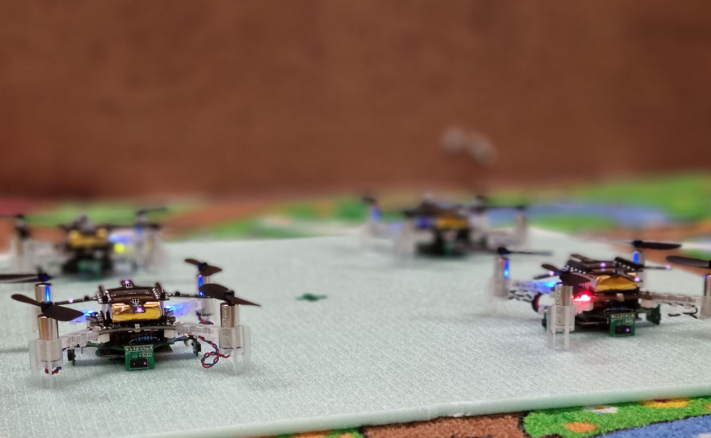
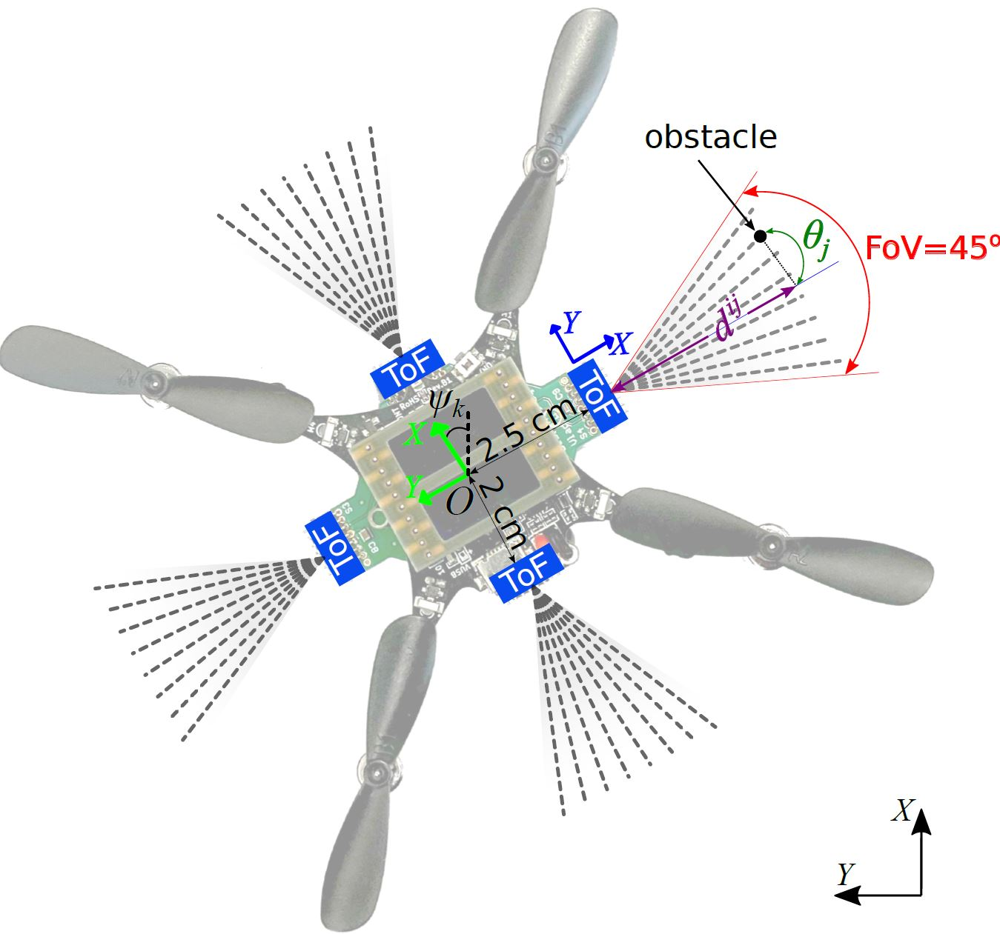

[![Contributors][contributors-shield]][contributors-url]
[![Forks][forks-shield]][forks-url]
[![Stargazers][stars-shield]][stars-url]
[![Issues][issues-shield]][issues-url]
[![License][license-shield]][license-url]

[contributors-shield]: https://img.shields.io/github/contributors/ETH-PBL/Nano_Swarm_Mapping.svg?style=flat-square
[contributors-url]: https://github.com/ETH-PBL/Nano_Swarm_Mapping/graphs/contributors
[forks-shield]: https://img.shields.io/github/forks/ETH-PBL/Nano_Swarm_Mapping.svg?style=flat-square
[forks-url]: https://github.com/ETH-PBL/Nano_Swarm_Mapping/network/members
[stars-shield]: https://img.shields.io/github/stars/ETH-PBL/Nano_Swarm_Mapping.svg?style=flat-square
[stars-url]: https://github.com/ETH-PBL/Nano_Swarm_Mapping/stargazers
[issues-shield]: https://img.shields.io/github/issues/ETH-PBL/Nano_Swarm_Mapping.svg?style=flat-square
[issues-url]: https://github.com/ETH-PBL/Nano_Swarm_Mapping/issues
[license-shield]: https://img.shields.io/github/license/ETH-PBL/Nano_Swarm_Mapping.svg?style=flat-square
[license-url]: https://github.com/ETH-PBL/Nano_Swarm_Mapping/blob/master/LICENSE

<h1 align="center">Fully Onboard SLAM for Distributed Mapping With a Swarm of Nano-Drones</h1>

<p align="center"><b>Carl Friess, Vlad Niculescu, Tommaso Polonelli, Michele Magno, Luca Benini</b></p>

<p float="center">
  
   
</p>

## About the Project

The use of Unmanned Aerial Vehicles (UAVs) is rapidly increasing in applications ranging from surveillance and first-aid missions to industrial automation involving cooperation with other machines or humans. To maximize area coverage and reduce mission latency, swarms of collaborating drones have become a significant research direction. However, this approach requires open challenges in positioning, mapping, and communications to be addressed. This work describes a distributed mapping system based on a swarm of nano-UAVs, characterized by a limited payload of 35 g and tightly constrained onboard sensing and computing capabilities. Each nano-UAV is equipped with four 64-pixel depth sensors that measure the relative distance to obstacles in four directions. The proposed system merges the information from the swarm and generates a coherent grid map without relying on any external infrastructure. The data fusion is performed using the iterative closest point algorithm and a graph-based simultaneous localization and mapping algorithm, running entirely onboard the UAV’s low-power ARM Cortex-M microcontroller with just 192 kB of memory. Field results gathered in three different mazes with a swarm of up to 4 nano-UAVs prove a mapping accuracy of 12 cm and demonstrate that the mapping time is inversely proportional to the number of agents. The proposed framework scales linearly in terms of communication bandwidth and onboard computational complexity, supporting communication between up to 20 nano-UAVs and mapping of areas up to 180 m2 with the chosen configuration requiring only 50 kB of memory.

**&#x23F5; Demo video:** [YouTube](https://youtu.be/c9hajp_43aw)

**&#x23F5; Publication:** [IEEE Internet of Things Journal](https://ieeexplore.ieee.org/document/10440144), [Arxiv](https://arxiv.org/abs/2309.03678)

```bibtex
@article{friess2024fully,
  title={Fully Onboard SLAM for Distributed Mapping With a Swarm of Nano-Drones},
  author={Friess, Carl and Niculescu, Vlad and Polonelli, Tommaso and Magno, Michele and Benini, Luca},
  journal={IEEE Internet of Things Journal},
  year={2024},
  doi={10.1109/JIOT.2024.3367451}
}
```

## Getting Started

This work was developed using a swarm of drones with the following hardware setup:

- The commercial nano-drone platform [Crazyflie 2.1](https://www.bitcraze.io/products/crazyflie-2-1/)
- A custom [sensor deck](https://github.com/ETH-PBL/NanoSLAM/tree/main/quad-tof-deck) which features four [VL53L5CX](https://www.st.com/resource/en/datasheet/vl53l5cx.pdf) ToF sensors and an SPI-Flash chip.
- The commercial [Flow-Deck v2](https://www.bitcraze.io/products/flow-deck-v2/)
- A custom [active motion capture marker deck](https://github.com/ETH-PBL/Active-motion-capture-marker-deck) *(optional)*


## Building and Flashing the Firmware

Building and flashing the firmware will require a compatible ARM toolchain to be installed. Please refer to the [bitcraze documentation](https://www.bitcraze.io/documentation/repository/crazyflie-firmware/master/building-and-flashing/build/#dependencies) on how to install a toolchain.

1. Clone the repository and it's submodules:
   
   ```sh
   git clone --recursive https://github.com/ETH-PBL/Nano_Swarm_Mapping.git
   ```

1. Configure the swarm size by setting the `SWARM_NUM_DRONES` variable in [`swarm-firmware/src/swarm/swarm.h`](https://github.com/ETH-PBL/Nano_Swarm_Mapping/blob/main/swarm-firmware/src/swarm/swarm.h) and configure the IDs of each drone by mapping them to the `MCU_ID_ADDRESS` of each drone (printed at boot to the debug console of the drone) in [`swarm-firmware/src/swarm/swarm.c`](https://github.com/ETH-PBL/Nano_Swarm_Mapping/blob/main/swarm-firmware/src/swarm/swarm.c).
   
1. Change into the swarm firmware directory and build the swarm firmware:
   
   ```sh
   cd swarm-firmware
   make clean all -j8
   ```
   
1. Plug in the CrazyRadio USB dongle. Flash each drone: First put it in the bootloader mode by turning it off and then holding the power button until the blue LEDs alternatively blink, then run `make cload`. Alternatively, all drones can be flashed automatically using the script [`swarm-firmware/cload-all.sh`](https://github.com/ETH-PBL/Nano_Swarm_Mapping/blob/main/swarm-firmware/cload-all.sh), taking care to adjust the addresses of the drones appropriately.

1. Follow the same steps to flash an additional drone that will remain grounded and be used to monitor the communication within swarm via the builtin USB connection.

   ```sh
   cd ../p2p-bridge
   make clean all -j8
   make cload
   ```
   
1. With the bridge drone connected to the computer via USB, launch the python bridge script to receive data from the swarm. The [bitcraze cflib](https://www.bitcraze.io/documentation/repository/crazyflie-lib-python/master/) will be required to communicate with the bridge drone. Optionally, a Vicon motion capture system can be used to establish a ground truth.
   
   ```sh
   python3 bridge.py data/test/
   ```
   
   The bridge drone and script are also used to send the initial take-off commands to the swarm.

1. If the debug console of individual drones needs to be monitored, it is recommended to use the [`tools/cf_console.py`](https://github.com/ETH-PBL/Nano_Swarm_Mapping/blob/main/tools/cf_console.py) script to reduce interference with P2P communication between the drones.

## Evaluation

We provide two Jupyter Notebooks showing how the data collected from the swarm can be interpreted:

- [`evaluation/swarm-slam-evaluation.ipynb`](https://github.com/ETH-PBL/Nano_Swarm_Mapping/blob/main/evaluation/swarm-slam-evaluation.ipynb)
- [`evaluation/gridmap.ipynb`](https://github.com/ETH-PBL/Nano_Swarm_Mapping/blob/main/evaluation/gridmap.ipynb)

## Acknowledgements
This work received support from the Swiss National Science Foundation Project 207913 "TinyTrainer: On-chip Training for TinyML devices".
